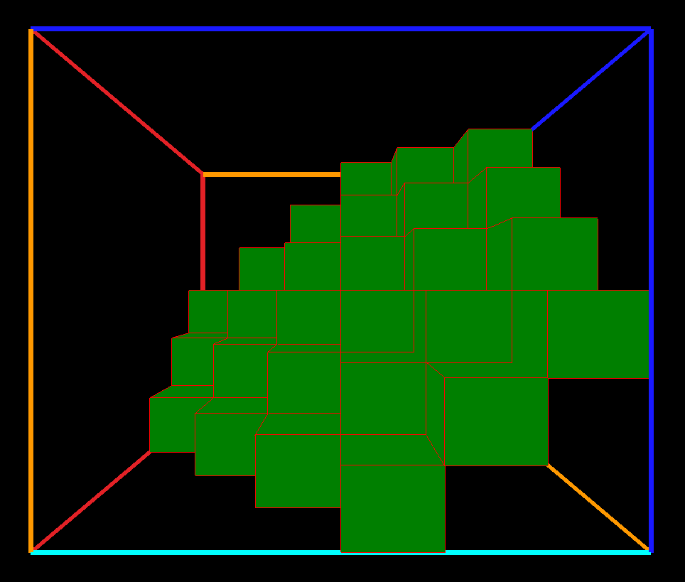

# Program do wizualizacji prawdopodobieństwa wyrzuconej sumy przy rzucie trzema kostkami

## Działanie
Kostka jest reprezentacją rzutu trzema kostkami w 3D. Jest wymiarów 6x6x6 *(6 oczek na każdej kostce)*. Pokazane zielone sześciany reprezentują sumę możliwe kombinacje, aby otrzymać daną sumę *(na zdjęciu kombinacje dla sumy 11)*.

## Struktura kostki
Pierwsza warstwa reprezentuje wynik 1 przy rzucie pierwszą kostką. Aby otrzymać 11 potrzebujemy jeszcze 10. Możliwe kombinacje przy rzucie trzecią i drugą kostką to:
- 4 + 6
- 5 + 5
- 6 + 4

Dlatego w pierwszej warstwie kostki widzimy 3 zielone sześciany odpowiadające tym przypadkom.
